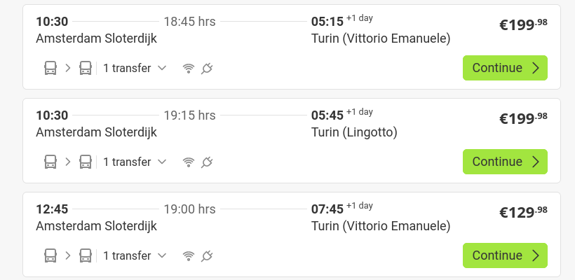
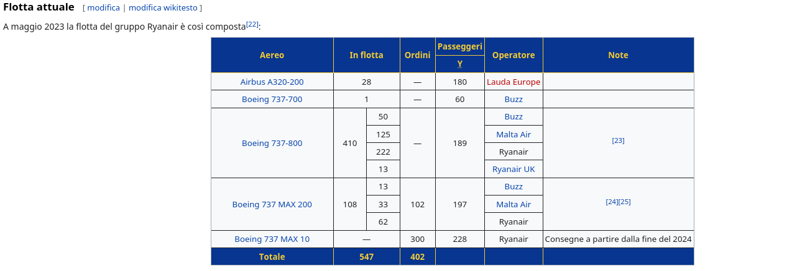
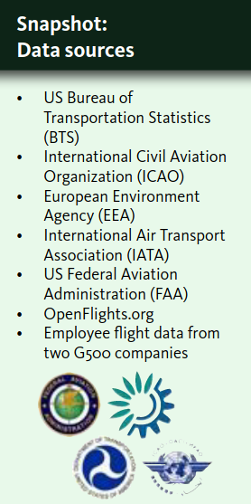

Ok questa e' piu' difficile.
Il problema che mi faccio e' il consumo di carburante.
In base ai conti che troverete sotto, senza ombra di dubbio la scelta finisce sul flixbus.

Potete cercare su Rome2rio tutte le partenze dall'Italia per arrivare ad Amsterdam in modo da trovare quella al prezzo minore: <https://www.rome2rio.com/it/map/Italia-Paese/Amsterdam/>

# costi

## andata

Flixbus ore 16:45 da TO, arrivo il giorno dopo alle 11:25 alla stazione di Amsterdam Sloterdijk.
Quella voglia di portarsi il portatile per programmare (>_<)>
Da li' 30 min per arrivare alla stazione di Alkmaar.
Da quella stazione c'e' uno shuttle che in 15 min ti porta direttamente all'entrata del festival.
Il camp del festival apre alle 10 e le attivita' aprono alle 12, quindi mettiamo che arrivo alle 13 al massimo mi perdo un'ora.

## ritorno

Finisce alle 4 di mattina di domenica... BEEENEEE...
Il camp chiude alle 14.
Wow ci sono dei prezzi che non mi aspettavo...

# prices

flixbus andata : 89
liquicity            : 160 (perche' ho fatto tardi senno' era di meno)
flixbus ritorno : 77 (troppe ore gia' lo so, ma bisogna riabituarsi a tempi naturali xD)
tot                      : 330

# nerd time

L'unico studio che ha senso fare per questo viaggio sono sulle compagnie di Ryanair e Easyjet.

## Ryanair

Wikipedia fornisce informazioni interessanti al riguardo.

### consumi per aereo

Il consumo degli aerei va a kg/h e per fare la conversione a litri bisogna avere la densita' del carburante.
In pratica se hai 2400 kg/h prendi solo la parte dei kg (2400) e la dividi per la densita' della sostanza ma facendo attenzione che la densita' sia espressa in chilogrammi al decimetro cubo (`kg/dm^3`). [source](https://www.youmath.it/domande-a-risposte/view/8490-kg-in-litri.html)
Ho notato che alcuni invece di usare `kg/dm^3` usano direttamente la dicitura `kg/l`.

Quindi `2400 / densita'` si ottenere il volume espresso in litri ed ora si riaggiungono le ore: litri/ora.

### la tabella finale

|veicolo|passeggieri|kgs/h|densita' carburante|litres/h|a persona|
|---|---|---|---|---|---|
|Airbus A320-200|180|2200–2600 kgs/hour|0,785 km/l|2803-3312 l/h|16-18 l/h|
|Boeing 737-700|60|2420 kg/h|0,785 km/l||~17 l/h|
|Boeing 737-800|189|2530 kg/h|0,785 km/l||~18 l/h|
|Boeing 737 MAX 200|197|2,000 kg|0,785 km/l|2548 l/h|12.7 l/h|
|Boeing 737 MAX 10|228|leggo cose strane a proposito di questo modello e non e' nemmeno in flotta, quindi ciao|

Visto che i `Boeing 737-800` sono la maggioranza mi baso su questo modello per fare i conti.

## Flixbus

- consumo a km
    - 0.257 l/km [source](https://cdn-cf.cms.flixbus.com/drupal-assets/2023-05/Well-to-Wheel%20Analysis%20atmosfair.pdf)
- consumo a km a persona (50 persone)
    - 0.005 l/km

## Italia -> Olanda

Torino -> Amsterdam

- in flixbus sono 1147 km
- in aereo sono 4/5 ore (le tratte dirette) [perche' quelle meno costose durano anche di piu']

## finiamo sta storia

0.005 * 1147 = 5.7 litri

4 ore * 18 l/h = 72 litri

## sources

- <https://matthewkling.github.io/assets/aviation_emissions.pdf/>
- <https://www.airliners.net/forum/viewtopic.php?t=1440797/>
- <https://ansperformance.eu/>
    - <https://ansperformance.eu/library/airbus-fuel-economy.pdf/>

### consumi

- <https://www.airliners.net/forum/viewtopic.php?t=1355819/>
- <https://web.archive.org/web/20140725005129/http://www.boeing.com/assets/pdf/commercial/startup/pdf/737ng_perf.pdf/>
- <https://simpleflying.com/cfm-leap-engines-enhance-performace-boeing-737-max/?newsletter_popup=1#fuel-consumption/>

#### consumi flixbus

- <https://cdn-cf.cms.flixbus.com/drupal-assets/2023-05/Well-to-Wheel%20Analysis%20atmosfair.pdf/>

### fonti per la densita'

- <https://www.smartcockpit.com/docs/A320-Fuel.pdf/>
    - 
- <https://www.quora.com/How-much-fuel-is-consumed-by-an-Airbus-A320-over-1000-kilometers/>

# notes

