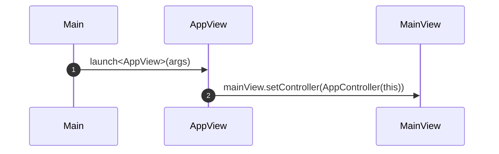
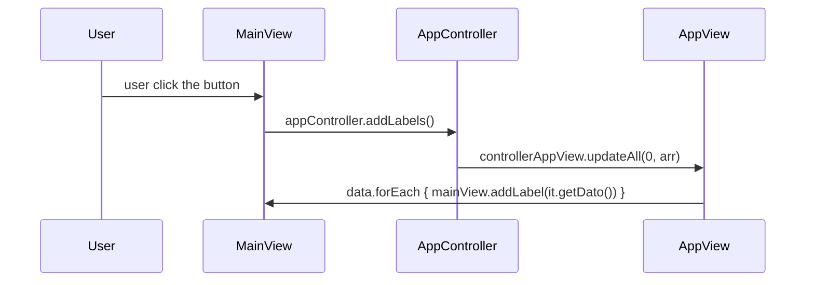

# Add Labels dinamcally from controller

# TL;DR - Minimal

```kt
class AppView : App(MainView::class), ControllerAppView {
    override fun updateAll(data: List<AppData>) {
				val labels = arrayListOf<Labels>()
				data.forEach(d -> {
					labels.add(Label(d))
				})
        val mainView = find(MainView::class)
				mainView.addLabel(labels))
    }
}

class MainView : View() {

    private val myVbox = VBox()

    override val root = tabpane {
        tab("Tab 1") {
						this.add(myVbox)
        }
    }

    fun addLabel(labels: List<Labels>) {
        myVbox.children.clear()
        myVbox.children.addAll(labels)
    }

}
```

## dir tree

```txt
Main.kt
view
	AppView.kt
model
	AppData.kt
controller
	AppController.kt
	ControllerAppView.kt
```

## flow

### init



### user click on button



## Main.kt

```kt
fun main(args: Array<String>) {
    launch<AppView>(args)
}
```

## AppData.kt

```kt
package model

class AppData(s: String) {
    private var dato: String
    init {
        this.dato = s
    }

    fun getDato() = dato
}
```

## AppController.kt

```kt
package controller

import model.AppData

class AppController(private val controllerAppView: ControllerAppView) {
    fun addLabels() {
        val arr = ArrayList<AppData>();
        arr.addAll(arrayListOf(AppData("hello"), AppData("io"), AppData("mangio"), AppData("biscotti")))
        controllerAppView.updateAll(0, arr)
    }
}
```

## ControllerAppView.kt

```kt
package controller

import model.AppData

interface ControllerAppView {
    fun updateAll(tab: Int, data: List<AppData>)
}
```

## AppView.kt

```kt
package view

import controller.AppController
import controller.ControllerAppView
import javafx.scene.control.Button
import javafx.scene.control.Label
import javafx.scene.layout.VBox
import javafx.scene.paint.Color
import javafx.stage.Screen
import javafx.stage.Stage
import model.AppData
import tornadofx.*

class AppView : App(MainView::class), ControllerAppView {

    override fun start(stage: Stage) {
        super.start(stage)
        val mainView = find(MainView::class)
        mainView.setController(AppController(this))
    }

    override fun updateAll(tabIndex: Int, data: List<AppData>) {
        val mainView = find(MainView::class)
        data.forEach {
            mainView.addLabel(it.getDato())
        }
    }
}

class MainView : View() {

    private lateinit var appController: AppController
    private val labels = mutableListOf<Label>()
    private val myVbox = VBox()

    init {
        reloadStylesheetsOnFocus()
        importStylesheet(MyStylesheet::class)
    }

    override val root = tabpane {
        tab("Tab 1") {
            vbox {
                this += Button("Press Me").apply {
                    textFill = Color.RED
                    action {
                        appController.addLabels()
                    }
                }
                this.add(myVbox)
            }
        }
        tab("Tab 2") {
            vbox {
                label("This is the content of Tab 2")
            }
        }
    }

    fun addLabel(text: String) {
        val label = Label(text)
        labels.add(label)
        myVbox.children.clear()
        myVbox.children.addAll(labels)
    }

    fun setController(appController: AppController) {
        this.appController = appController
    }

    init {
        primaryStage.width = Screen.getPrimary().bounds.width / 2
        primaryStage.height = Screen.getPrimary().bounds.height - 210.0
        primaryStage.x = 50.0
        primaryStage.y = 50.0
        try {
            primaryStage.scene.stylesheets.add("styles.css")
        } catch (e: Exception) {
            e.printStackTrace()
        }
        primaryStage.show()
    }
}

class MyStylesheet : Stylesheet() {
    init {
        root {
            baseColor = Color.BLACK
            accentColor = Color.WHITE
        }
    }
}
```
