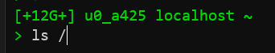

# PS1

Pimp your prompt!

- <https://bashrcgenerator.com/>
- <https://scriptim.github.io/bash-prompt-generator/>

```bash
nano ~/.bash_profile
# PS1='\[\e[0m\][\[\e[0m\]placeholder\[\e[0m\]]\[\e[0m\]'
source ~/.bash_profile
```

```bash
# \[\e[0m\] --> this is used if you want to change color or return to default color
```

## Better

```bash
free_available_space=$(df -h /data/data/com.termux/files/home | awk 'NR == 2 { print $4 }')
PS1='\[\e[0;38;5;40m\]['+$free_available_space+'] '  # [free space available] 
PS1+='\u \H \w \n> \[\e[0m\]'                        # username hostname ~/bin
```




