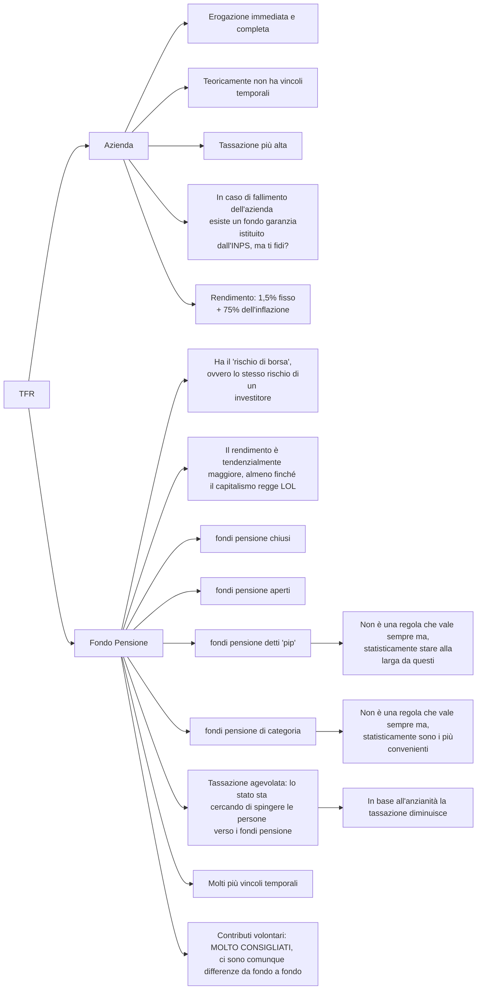

# TFR - Trattamento fine rapporto (liquidazione)



## Fondo pensione & Azienda, P.IVA & Dipendente

- il TFR lo hanno solo i dipendenti
- il TFR i P.IVA ***non*** lo hanno
- il datore di lavoro è obbligato per legge a mettere da parte questa somma (TFR annuale === 6,91% della RAL)
- [Fondo di garanzia per i dipendenti anche in caso di fallimento dell'azienda](https://www.inps.it/it/it/dettaglio-scheda.schede-servizio-strumento.schede-servizi.50186.fondo-di-garanzia-del-tfr-e-dei-crediti-di-lavoro.html)
- il fondo pensione non ha un rendimento garantito
- il fondo pensione non segue l'inflazione (come fa invece per legge il TFR lasciato in azienda)

## TFR lasciato in azienda, puntualizzazioni

La Legge n. 297 del 27 dicembre 1986 prevede una rivalutazione del TFR pari al 75% dell'inflazione rilevata dall'ISTAT. Questa legge prevede che il TFR non pagato al momento della cessazione del rapporto di lavoro venga rivalutato annualmente, a partire dal 1° gennaio dell'anno successivo a quello di maturazione, in misura pari al 75% della variazione percentuale dell'indice ISTAT dei prezzi al consumo per le famiglie di operai e impiegati.

```txt
inflazione (circa) === variazione percentuale dell'indice ISTAT dei prezzi al consumo per le famiglie di operai e impiegati.
```

E' importante sottolineare che la legge ***prevede la rivalutazione del TFR non pagato al momento della cessazione del rapporto di lavoro, non del TFR lasciato in azienda***. Inoltre, ***la legge può subire modifiche nel tempo***, pertanto è sempre opportuno verificare la normativa vigente in materia.

## Fondi pensione, puntualizzazioni

### Di categoria

I fondi pensione di categoria sono dei fondi pensione riservati a determinate categorie di lavoratori, come ad esempio i lavoratori del settore pubblico, i lavoratori autonomi, gli artigiani e così via. Essi sono gestiti da enti specifici, come ad esempio INPS, INARCASSA, ENPAPI, ENPAM e così via, e prevedono regole di accesso e di contribuzione particolari per ciascuna categoria di lavoratori.

### Fondi aperti

I fondi pensione aperti, invece, sono accessibili a tutti i soggetti che ne fanno richiesta e prevedono regole di accesso e di contribuzione standard.

### Fondi chiusi

I fondi pensione chiusi, invece, sono riservati ai dipendenti di un'azienda o di un gruppo di aziende che hanno stipulato una convenzione con il fondo pensione. In questo caso, l'adesione al fondo è (o potrebbe essere?) obbligatoria per i dipendenti che ne soddisfano i requisiti di partecipazione.

### PIP

Infine, i PIP (Piani individuali pensionistici) sono dei prodotti di previdenza complementare che permettono al lavoratore di costituire una propria riserva pensionistica a fronte di una prestazione economica annua. Essi non sono legati a una specifica categoria professionale, ma sono accessibili a tutti i lavoratori che ne fanno richiesta.

## Analisi

- il problema, in questo contesto, dell'Italia, è l'INPS
    - 23 milioni di lavoratori che pagano le tasse su 60 milioni di persone (fa riflettere)
- tutto dipende dai propri piani di vita
- se i soldi del TFR servono immediatamente, allora lascialo in azienda, in caso contrario informarsi sul fondo pensione più adatto alle proprie esigenze

### Dove informarsi?

#### Fondi pensione di categoria (chatGPT generated)

- INPS: il sito dell'Istituto Nazionale della Previdenza Sociale offre un servizio di consultazione dei fondi pensione di categoria. Puoi accedere a questa sezione del sito cliccando sul link "Fondi Pensione" presente nella sezione "Prestazioni e Servizi" della home page dell'INPS.
- COVIP: la Commissione di Vigilanza sui Fondi Pensione ha un portale web sul quale è possibile consultare le informazioni sui fondi pensione di categoria. Puoi accedere a questa sezione del sito cliccando sul link "Fondi pensione" presente nel menu principale del sito.
- ASSOPREVIDENZA: è l'Associazione Italiana degli Organismi di Previdenza Complementare. Sul sito dell'associazione puoi trovare informazioni sui fondi pensione di categoria e sui piani pensionistici offerti dalle diverse categorie di lavoratori.
- FONDIAPERTI.it: è un portale web che si occupa di fornire informazioni sui fondi pensione aperti e di categoria. Sul sito puoi trovare schede informative sui diversi fondi pensione, con indicazioni sulle performance, i costi e le caratteristiche specifiche di ciascun fondo.

# Sources

- <https://www.youtube.com/watch?v=N0N3LjZSLEU/>
