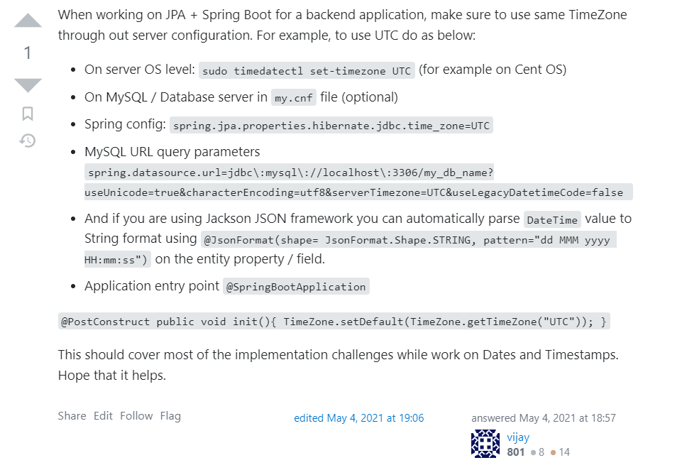

# Mappare le date

# Configurare il TimeZone

I punti che conosco dove il timezone può essere settato:
- `spring.jpa.properties.hibernate.jdbc.time_zone=UTC`
- `spring.jackson.time-zone=IST`
- `jdbc:mysql://127.0.0.1/db_name?useLegacyDatetimeCode=false&serverTimezone=Asia/Kolkata`

## Immagine di luce pura




# Entity

```java
import java.util.Date;
import org.springframework.format.annotation.DateTimeFormat;
import jakarta.persistence.Column;
import jakarta.persistence.Temporal;
import jakarta.persistence.TemporalType;

@Column(name = "last_black_osint", nullable = false)
@DateTimeFormat(pattern = "yyyy-MM-dd HH:mm:ss")
@Temporal(TemporalType.TIMESTAMP)
private Date date;
```

# Sources

- <https://vladmihalcea.com/date-timestamp-jpa-hibernate/>
- <https://vladmihalcea.com/time-zones-java-web-application/>
- [settare il timezone della stringa di connessione con il database](https://stackoverflow.com/a/63169257/16988820)