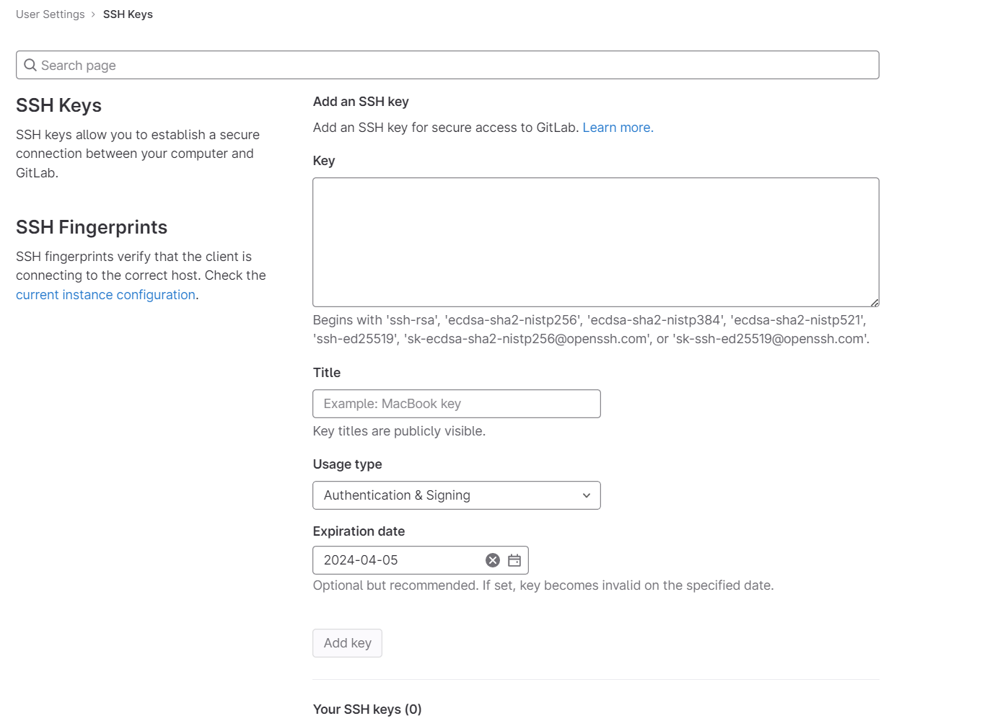

# Come creare ed usare una chiave ssh per git

```bash
ssh-keygen -t ed25519 -C "your_email_used_in@git.net"
```

Ora andare a prendere la chiave `pubblica` su `C:\Users\${USERNAME}/.ssh/id_ed25519.pub` e copiarla su github, o gitlab.



Per usarla invece di usare il protocollo HTTP, si usa ad esempio il protocollo GIT che andrà ad usare automaticamente l'ssh.

```bash
git@hostname.net:path/to/proj/repo.git
```