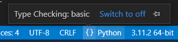

# Impostazioni di base

## Configurare PyLance (se è stato scaricato)

Quando si installano i packages con la dicitura `--user`:

```bash
python -m pip install --user pysimplegui
```

Essi vengono installati in una cartella che deve essere indicata sulle impostazioni di PyLance per usufruire delle sue funzionalità.
Quindi, aprire i settaggi di vscode:

1. ctrl + shift + p
2. "Preferences: Open **User** Settings (JSON)"
3. aggiungere:

```json
"python.analysis.extraPaths": [
	"C:\\Users\\{your username}\\AppData\\Roaming\\Python\\Python311\\site-packages",
	"C:\\Users\\{your username}\\AppData\\Local\\Programs\\Python\\Python311\\Lib\\site-packages",
	/* "C:\\Python311\\Lib\\site-packages" questo percorso non è a livello di utente quindi non va indicato: dovrebbe esserci automaticamente */
]
```

> notare che il tuo python potrebbe essere installato in una cartella diversa e salvare le lib in un altro percorso

### Metodo più stupido

```python
import sys
sys.path.append("C:\\Users\\{username}\\AppData\\Roaming\\Python\\Python311\\site-packages")
import PySimpleGUI as pg
pg.Window(title="Hello World", layout=[[]], margins=(200, 50)).read()
```

## Setup type checking

Su vscode è possibile attivare il typechecking in python come mostrato nell'immagine:


<br>
Per farlo bisogna posizionare il mouse sopra le parentesi grafe.
Probabilmente a fornire questa possibilità è una delle estensioni, credo PyLance.
Puoi anche aggiungere questo al `settings.json`:

```json
"python.analysis.typeCheckingMode": "basic"
```
