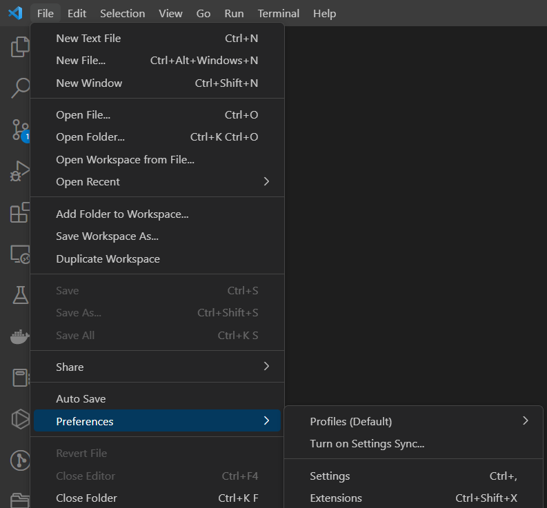

# Index

## How to start

1. Download [VSCode](https://code.visualstudio.com/)
2. Install [Python Extension Pack](https://marketplace.visualstudio.com/items?itemName=donjayamanne.python-extension-pack)

## 1

VSCode si installa come qualsiasi altro programma, non dovrebbe essere difficile.

## 2

Per installare l'estensione invece andare qui:

## Come continuare

Di "Python Extension Pack" ne esistono a decine, tipo "Python Dev Extension Pack" ha qualcosa tipo altri 7/8 plugin in più...
Per imparare a programmare in generale consiglio chatGPT.
In mancanza di questo strumento consiglio [Corey Schafer](https://www.youtube.com/watch?v=YYXdXT2l-Gg&list=PL-osiE80TeTt2d9bfVyTiXJA-UTHn6WwU).
Se non capisci l'inglese, inizia con l'imparare l'inglese.
