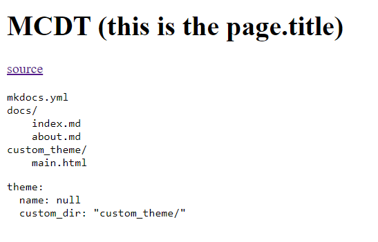

# MCDT (this is the page.title)

> MkDocs uses Jinja2 as its default templating engine.

[source](https://www.mkdocs.org/dev-guide/themes/#creating-a-custom-theme)

## dir tree

```txt
mkdocs.yml
docs/
    index.md
    about.md
custom_theme/
    main.html
```

## mkdocs.yml

```yaml
theme:
  name: null
  custom_dir: "custom_theme/"
```

## main.html

```html
<!DOCTYPE html>
<html>
  <head>
    <title>
      {{ page.title }} - {{ config.site_name }}
    </title>
  </head>

  <body>
    {{ page.content }}
  </body>
</html>
```

## This is an image of the result by now



## This is not working


# > [Part 2 - Add some css](part2-add-some-css.md)
