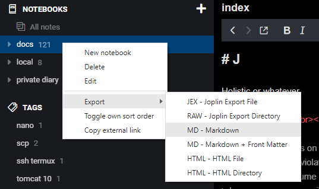
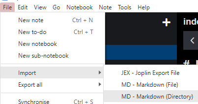
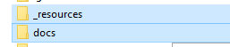

# import export from joplin

## when exporting

1. click on the notebook you what to export

    

2. save on desktop

## when importing

1. select option

    

2. the folder `docs` has to be near the `_resources` dir

    

3. select docs and because md files containt url pointing to _resources, also these will be loaded into Joplin